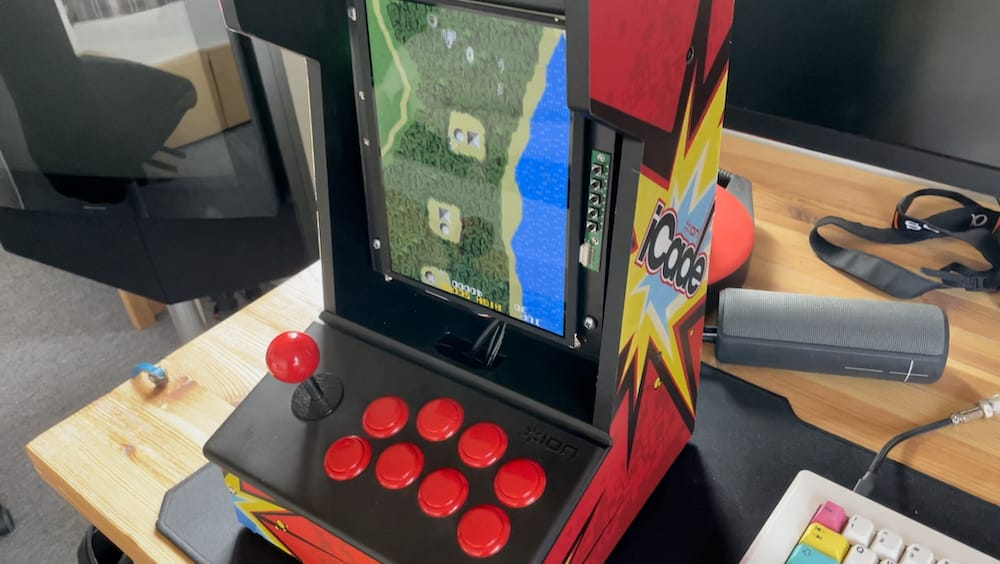

# The **Mini MiSTer Arcade** Resource Page
I am gathering all the stuff I can find about the best way to use an iPad 3/4 display in a mini arcade machine, like the iCade.

This is my current build.
